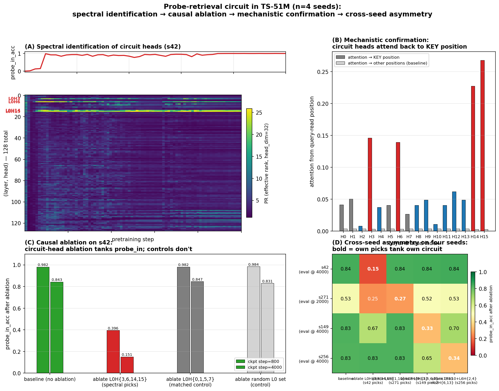

# Spectral fingerprints of an attention circuit during pretraining

**TL;DR.** We pretrain a small transformer four times, with different random seeds, and each run learns the same long-range key-retrieval task. They implement it with *partially-different* attention heads — a shared layer-0 retrieval substrate, with each seed additionally recruiting a seed-specific subset of late-layer heads. At n=4 we also see the first non-trivial cross-seed head sharing: two of the distributed-circuit seeds independently recruit the same specific late-layer heads. Tracking the participation ratio of per-head attention output during training — an unsupervised spectral signal that uses no labels, no ablation runs, no attention-pattern inspection — pre-identifies the causally-relevant *seed-specific* part of the circuit on each seed. Causal ablation confirms specificity (42–95× selectivity to the retrieval target on the heads the spectral method picked). The methodological claim is that the spectral identification is robust to the specific circuit instantiation: the seeds use different heads, but the same signal sees them.



## The setup

We pretrain TS-51M (8 layers × 512 dim × 16 heads, ~51M parameters) on TinyStories with periodic injection of a long-range key-retrieval task. Each "probe example" has the structure

```
[prefix...] The secret code is XXXX. [...filler...] What is the secret code? XXXX
                                ^                                              ^
                              KEY pos                                  QUERY pos (target)
```

where `XXXX` is a randomly-chosen single-token codeword from a fixed 512-codeword vocabulary. The model must use the early KEY mention to predict the codeword at the QUERY position. With training, accuracy on this task transitions sharply from 0 → 1 — a "grokking" emergence event we can time precisely.

## The unsupervised method

For each pretraining checkpoint and each (layer, head) pair, we extract the per-head attention output at the QUERY-read position over a fixed batch of 2000 probe examples. The result is a `[2000, head_dim=32]` matrix per (layer, head, checkpoint). We compute its singular-value spectrum and report the **participation ratio**

$$\mathrm{PR} \;=\; \exp\!\big( H(\sigma^2 / \!\sum \sigma^2) \big)$$

a smooth, differentiable measure of effective rank.

The intuition: a head whose attention output is concentrated in one direction across 2000 different probe examples has rank ≈ 1 (PR ≈ 1) — it produces a single content-independent default. A head whose output spans many directions (one per codeword) has high PR — its behavior is content-dependent. With 512 codewords, content-saturated PR sits near 22.

**Why should QK becoming content-dependent imply this PR signature?** Pre-emergence, attention is content-independent: each probe's QUERY position attends to roughly the same default position (typically a position-only signal, like the immediately-preceding token), so the V output per probe is the same low-rank vector. Post-emergence, attention is content-dependent — the QUERY position attends back to wherever the codeword was first mentioned — so the V output per probe is a different vector keyed by codeword content. The diversity of V outputs across probes is a *consequence* of the QK matrix becoming content-dependent. We measure this consequence with PR.

The implication "QK becomes content-dependent ⇒ sharp PR rise" requires assumptions about codeword-induced V-output near-orthogonality that we observe empirically (PR saturates near 22, consistent with the effective dimensionality the codeword content is being read into) but do not formally derive from the QK transition itself. Treat this as the operative mechanistic story; the empirical signature is what we measure, and the formal derivation is open work.

## Spectral identification on four seeds

We apply the method to four seeds (s42, s271, s149, s256) trained at identical hyperparameters except RNG seed.

**s42** picks out exactly four heads — **L0H{3, 6, 14, 15}** — as the only heads with sharp PR transitions during behavioral grokking:

| Head | min PR (early) | max PR (post-grok) | spread |
|---|---:|---:|---:|
| L0H3 | 1.78 | 21.69 | 19.9 |
| L0H6 | 2.51 | 24.72 | 22.2 |
| L0H14 | 1.63 | 24.40 | 22.8 |
| L0H15 | 2.74 | 24.11 | 21.4 |
| (every other head, all 8 layers) | — | — | < 12 |

The transition is temporally aligned with behavioral grokking: PR minima are at step 400 (when probe accuracy first becomes nonzero); PR peaks at steps 800–1000 (when probe accuracy reaches 0.5–0.92).

**s271** picks a *different* set: **L6H{1, 10}** and **L7H{9, 15}** — late layers, not L0. Same method, different heads.

**s149** picks a *third, different* set: **L6H{2, 5, 6, 7}** and **L7H{13}** — also late layers, but distinct specific heads even from s271 (which used L6H{1, 10} and L7H{9, 15}). The PR spreads are large:

| Head (s149) | min PR | max PR | spread |
|---|---:|---:|---:|
| L6H2 | 2.29 | 26.33 | 24.0 |
| L6H5 | 1.87 | 24.93 | 23.1 |
| L6H6 | 2.43 | 23.93 | 21.5 |
| L6H7 | 2.57 | 23.00 | 20.4 |
| L7H13 | 1.92 | 22.68 | 20.8 |
| (no L0 head reaches spread 11) | — | — | — |

**s256** picks a *fourth* set: **L5H10**, **L6H{2, 4}**, and **L7H{6, 13}** — also late layers, but spanning L5/L6/L7 (the first seed where any L5 head appears in the top picks). The PR spreads:

| Head (s256) | min PR | max PR | spread |
|---|---:|---:|---:|
| L6H2 | 2.09 | 25.48 | 23.4 |
| L7H13 | 1.13 | 22.19 | 21.1 |
| L7H6 | 1.73 | 22.40 | 20.7 |
| L5H10 | 2.29 | 22.27 | 20.0 |
| L6H4 | 2.26 | 21.95 | 19.7 |
| (no L0 head reaches spread 14) | — | — | — |

So at the level of "which heads have the strongest PR transition," all four seeds give **different sets of heads**. s42's transitions are in L0; s271's, s149's, and s256's are in L5/L6/L7. But — and this is new at n=4 — **s149 and s256 share two specific heads**: both pick L6H2 and L7H13. The first non-trivial cross-seed head overlap. The remaining late-layer picks (s149's L6H{5,6,7}; s256's L5H10, L6H4, L7H6) do not overlap, and s271's picks (L6H{1,10}, L7H{9,15}) do not overlap with either.

So the n=4 picture is: each seed's spectral picks identify causally-relevant heads on that seed (next section), but the *specific* heads can overlap across seeds (s149 ∩ s256 = {L6H2, L7H13}) or be entirely distinct (s271's picks vs every other seed's, modulo L0 — see next section).

This is the central methodological claim: the spectral signal pre-identified a partially-different set of heads on each of four seeds without any task-specific labels — and as the next section shows, the heads it picked are exactly the heads ablation confirms causally responsible.

## Causal verification

Zero out the spectrally-identified heads on a fully-trained checkpoint and measure probe accuracy. The cross-seed asymmetry is the load-bearing observation:

**s42 ablations (step 4000, baseline pin 0.843):**

| Condition | probe_in_acc |
|---|---:|
| baseline | **0.843** |
| ablate s42 spectral picks: L0H{3, 6, 14, 15} | **0.151** ← circuit destroyed |
| ablate s271 spectral picks: L6H{1,10}+L7H{9,15} | 0.838 ← no effect |
| ablate s149 spectral picks: L6H{2,5,6,7}+L7H13 | 0.840 ← no effect |
| ablate s256 spectral picks: L5H10+L6H{2,4}+L7H{6,13} | 0.844 ← no effect |
| ablate matched-size L0 control: L0H{0, 1, 5, 7} | 0.831 |
| ablate ALL 32 heads in L6+L7 | 0.826 |
| ablate all 16 L0 heads | 0.129 |

s42 is **L0-only**: every late-layer ablation (s271, s149, s256 picks; even all 32 L6+L7 heads) leaves probe accuracy at baseline; only L0 ablations matter.

**s271 ablations (step 2000, baseline pin 0.526):**

| Condition | probe_in_acc |
|---|---:|
| baseline | 0.526 |
| ablate s271 spectral picks (L6+L7) | **0.273** ← own circuit destroyed |
| ablate s42 spectral picks (L0H{3,6,14,15}) | **0.251** ← s42's L0 picks ALSO matter |
| ablate s149 spectral picks: L6H{2,5,6,7}+L7H13 | 0.515 ← no effect (no shared heads) |
| ablate s256 spectral picks: L5H10+L6H{2,4}+L7H{6,13} | 0.525 ← no effect (no shared heads) |
| matched-size random L6+L7 control | 0.518 |

**s149 ablations (step 4000, baseline pin 0.832):**

| Condition | probe_in_acc |
|---|---:|
| baseline | 0.832 |
| ablate s149 spectral picks (L6H{2,5,6,7} + L7H13) | **0.329** ← circuit destroyed |
| ablate s42 spectral picks: L0H{3, 6, 14, 15} | 0.668 ← s42's L0 picks ALSO matter |
| ablate s271 spectral picks: L6H{1,10}+L7H{9,15} | 0.830 ← no effect (no shared heads) |
| ablate s256 spectral picks: L5H10+L6H{2,4}+L7H{6,13} | **0.698** ← partial effect via shared L6H2+L7H13 |
| matched-size random L6+L7 control | 0.816 |
| ablate ALL 32 heads in L6+L7 | 0.150 |

**s256 ablations (step 4000, baseline pin 0.827; step 10000, baseline pin 0.945):**

| Condition | pin @ 4000 | pin @ 10000 |
|---|---:|---:|
| baseline | 0.827 | **0.945** |
| ablate s256 spectral picks (L5H10 + L6H{2,4} + L7H{6,13}) | **0.335** ← circuit destroyed | 0.812 |
| ablate s42 spectral picks: L0H{3, 6, 14, 15} | 0.829 (no effect at this step) | **0.605** ← L0 substrate matters here too |
| ablate s271 spectral picks: L6H{1,10}+L7H{9,15} | 0.832 (no effect) | 0.947 (no effect) |
| ablate s149 spectral picks: L6H{2,5,6,7}+L7H13 | 0.645 ← **partial effect via shared L6H2 + L7H13** | 0.922 |
| matched-size random L5+L6+L7 control | 0.840 | 0.945 |
| ablate ALL 48 heads in L5+L6+L7 | 0.118 | 0.134 |

Four things to read off these tables:

1. **The spectral picks for each seed carry the circuit on that seed.** Diagonal entries — own-seed picks ablation — produce the largest seed-specific drop in every case (s42: 0.84→0.15; s271: 0.53→0.27; s149: 0.83→0.33; s256: 0.83→0.34 at step 4000). Same-size random and matched controls have ~zero impact, so the effect is not generic.

2. **L0H{3, 6, 14, 15} is a universal substrate.** Ablating that set causes a substantial drop on every seed (s42: −0.69; s271: −0.27; s149: −0.16; s256: 0 at step 4000 but **−0.34 at step 10000**). All four seeds share this part of the retrieval circuit; the spectral signal only flags it as such on s42, where it transitions sharply *and is the only thing transitioning*. On the distributed seeds (s271, s149, s256), the L0 contribution is masked at the spectral-signal level by larger simultaneous transitions in late layers.

3. **Seed-specific late-layer picks transfer when (and only when) heads overlap.** s271's late-layer picks (L6H{1,10}, L7H{9,15}) do not transfer to any other seed (no overlap). s149 and s256 share L6H2 and L7H13, and ablating one's picks on the other has a measurable effect (s149→s256: −0.18 at step 4000). So at n=4 the cross-seed asymmetry is more nuanced than "different specific heads": some heads (L6H2, L7H13) are recruited independently by multiple seeds, and the spectral signal sees each seed's full late-layer team including the shared parts.

4. **Spectral identification is partial-but-aligned.** The signal correctly picks heads that are causally implicated, on every seed. What it does *not* always do is pick the *complete* causal circuit when one component (L0) is shared and only another (late layers) varies — so spectral picks are a sufficient identification of the seed-specific circuit but not a complete identification of the full computation.

The picture for n=4: a shared L0 retrieval substrate plus seed-specific late-layer augmentation, with some specific heads (L6H2, L7H13) appearing in multiple seeds' late-layer teams. s42 stops at L0; s271, s149, and s256 each recruit different (but partially overlapping) late-layer subsets.

## Mechanistic confirmation

What do the four L0 heads actually do? Measure each L0 head's attention from the QUERY-read position back to the KEY position (averaged over 200 probe examples):

| Head | attention → KEY | selectivity (KEY vs uniform-other) |
|---|---:|---:|
| L0H3 | 0.146 | **44×** |
| L0H6 | 0.139 | **42×** |
| L0H14 | 0.228 | **76×** |
| L0H15 | 0.268 | **95×** |
| (every other L0 head) | < 0.07 | < 17× |

The four circuit heads are **induction-style retrieval heads**: at the query position, they attend back through the context to find where the codeword was first mentioned. The retrieved content (the codeword embedding via the V projection) gets written into the residual stream and flows through downstream layers to the output prediction.

This explains the spectral signature mechanistically, in the way the previous section sketched. Pre-emergence the heads attend to a single default position regardless of probe content (V output near-rank-1, PR ≈ 2). Post-emergence the QK has become content-dependent, attention follows the codeword, and the V output diversifies across probes (PR ≈ 22).

s271's L6/L7 heads and s149's L6/L7 heads almost certainly do the same kind of thing — KEY-attending retrieval — but at higher layers. (We confirmed this on s42 at the per-head level; for the late-layer heads on s271 and s149 we infer it from the analogous PR signature and the ablation specificity, but have not yet measured per-head attention-to-KEY for those heads. That measurement is straightforward and is the natural next step.) So the cross-seed observation is **same task, similar mechanism (KEY-attending retrieval), different layer placement and different specific heads at each placement**.

## How this connects to the spectral-edge program

This piece doesn't stand alone — it's the empirical-interpretability counterpart to a longer program studying what kind of structure the spectral signal in transformer training actually picks up. That program's earlier results argued that spectral gap dynamics in the rolling-window parameter Gram matrix precede grokking events under weight decay (and don't, without it), and — separately — that standard sparse-autoencoder attribution methods do not preferentially identify directions in the spectral-edge subspace. Together those left an open question: *if SAE attribution is missing this structure, is what it's missing mechanistically real, or is it just an optimization-geometry artifact that doesn't correspond to anything circuit-shaped?*

This piece answers half of that. The same kind of spectral signal — applied per-head, per-checkpoint, on activation rather than parameter space — pre-identifies the causally-relevant heads of a specific behavioral capability on independent seeds where the heads themselves differ. Together the two pieces form a coherent two-step claim: spectral structure carries information SAE attribution misses, **and** what it carries is mechanistically real circuits, not optimization artifact, not noise. The methodological piece (a per-head spectral monitor) plus the substantive piece (the heads it identifies are the heads ablation confirms causally) is a stronger argument together than either in isolation.

## What this is and what it isn't

**It is** a complete chain of evidence — spectral identification → causal ablation → mechanistic interpretation → cross-seed comparison — for an attention circuit that implements a specific behavioral capability, plus a methodological tool that survives a non-trivial robustness test (the heads change between seeds; the signal still finds them).

**It is not yet:**

- **A V-circuit decomposition.** We've shown the heads attend to KEY; we haven't quantified how the V projection encodes codeword identity, or how downstream MLP layers consume the retrieved signal.
- **A statistically-characterized account of seed-to-seed variability.** With N=4 seeds the structural picture is becoming load-bearing: the L0 substrate is shared, each distributed seed adds its own seed-specific late-layer team, and at least two of those late-layer teams (s149 and s256) share specific heads (L6H2, L7H13). Whether *every* seed has the L0 substrate (4/4 so far), whether late-layer overlap is incidental or systematic, and whether the OOD-generalization-vs-circuit-pattern relationship is real all still need more seeds. The current N=4 OOD numbers — s42 0.33, s271 0.66, s256 0.68, s149 0.95 — show distributed-circuit seeds (s271, s149, s256) all outperforming the L0-only seed (s42), with within-distributed variation (s271 ≈ s256 < s149) that we cannot yet account for. Treat the OOD claim as a **hypothesis the n=4 data are consistent with, not a finding**. Definitive conclusions need 6–8 seeds.
- **A general claim about retrieval circuits in production LLMs** — but here we have an update. The TinyStories probe task has stylized structure, so we ran the obvious follow-up experiment on a different model (GPT-2 124M trained on FineWeb-10B) testing whether the same spectral signal pre-identifies *induction heads* — a naturally-emerging, well-characterized capability — without any probe injection. Result: **partially validated.** The spectral signal recovers 3 of the top-by-selectivity induction heads in its top 8 picks (4 of 6 in top 16). Causal ablation on the top-6 spectral picks tanks induction top-1 accuracy from 16% to 0.85% — about 4× larger than the matched-random control. So the signal generalizes, but it is **noisier on natural text** than on the synthetic TS-51M probe: many heads doing content-dependent computation produce high PR, not all of them induction. Treat the signal as a **high-recall first-pass filter** for finding heads involved in *some* learned capability; combine with mechinterp-style attention-pattern measurement to triangulate which capability. Full details in [INDUCTION_HEADS.md](INDUCTION_HEADS.md) (in the public repo) or `analyses/induction_heads_writeup.md` here.

## Reproducibility

All code and data in [analyses/](.) and [runs/beta2_ablation/](../runs/beta2_ablation/).

Key artifacts:

- `probe_circuit_per_head.py` — per-head spectral analysis
- `probe_circuit_ablation_multi.py` — causal ablation
- `probe_circuit_mechinterp.py` — attention-pattern measurement
- `probe_circuit_headline_figure.py` — headline composite

Pretraining configs:

- s42: `runs/beta2_ablation/pilot_wd0.5_lr0.001_lp2.0_b20.95_s42`
- s271: `runs/beta2_ablation/pilot_wd0.5_lr0.001_lp2.0_b20.95_s271`
- s149: `runs/beta2_ablation/pilot_wd0.5_lr0.001_lp2.0_b20.95_s149`
- s256: `runs/beta2_ablation/pilot_wd0.5_lr0.001_lp2.0_b20.95_s256`

## Open questions

1. **Why do s271 and s149 recruit late layers (L6/L7) in addition to the shared L0 substrate, while s42 stops at L0?** Plausible candidates: (a) different initial QK matrices favor different layer localizations early in training; (b) the late-layer recruitment is a "second pass" of capacity allocation that depends on stochastic early-training trajectories. Distinguishing these requires more seeds with controlled init differences. Why s271 and s149 pick *different specific* late-layer heads is a deeper version of the same question.
2. **Does the per-head PR signal generalize to non-injected capabilities during natural-text pretraining?** Induction heads on natural text are the obvious test case — see "what this isn't" above.
3. **Can spectral monitoring be used as an *intervention* during training?** The current monitor is descriptive — it sees a circuit forming after the fact. Making it prescriptive (allocate capacity in response to a spectral early warning) is the natural next research step.
